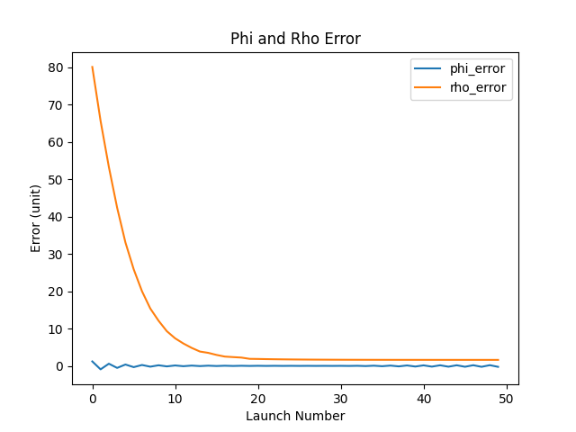

# projectile

## background
This is a project from one of my classes. This project was based in a scenario in which the world was coming to end as a volcano was about to erupt that would destroy the world. To prevent the destruction, we had to shoot Furbies (stuffed animal toy) into the volcano to plug it up.

## final result
<p align="center">
  
</p>

## setup
<p align="center" float="left">
  
  
</p>

## data
<p align="center" float="left">
  
  
</p>

output.txt
```
Test of xycircle((0, 0, 0), 2, 5) call:
[[ 0.0000000e+00  0.0000000e+00  2.0000000e+00]
 [ 0.0000000e+00  2.0000000e+00  1.2246468e-16]
 [ 0.0000000e+00  2.4492936e-16 -2.0000000e+00]
 [ 0.0000000e+00 -2.0000000e+00 -3.6739404e-16]
 [ 0.0000000e+00 -4.8985872e-16  2.0000000e+00]]

First 5 elements of z traj:
 [0.         0.14107194 0.28116191 0.42026992 0.55839597]

First 5 elements of y traj:
 [0. 0. 0. 0. 0.]

First 5 elements of x traj:
 [0.         0.14156292 0.28312584 0.42468876 0.56625168]

Calling landingpos(traj, pos_target[0]):
 (0.0, 69.93208206329419)

PID Iteration: 31.5
```
